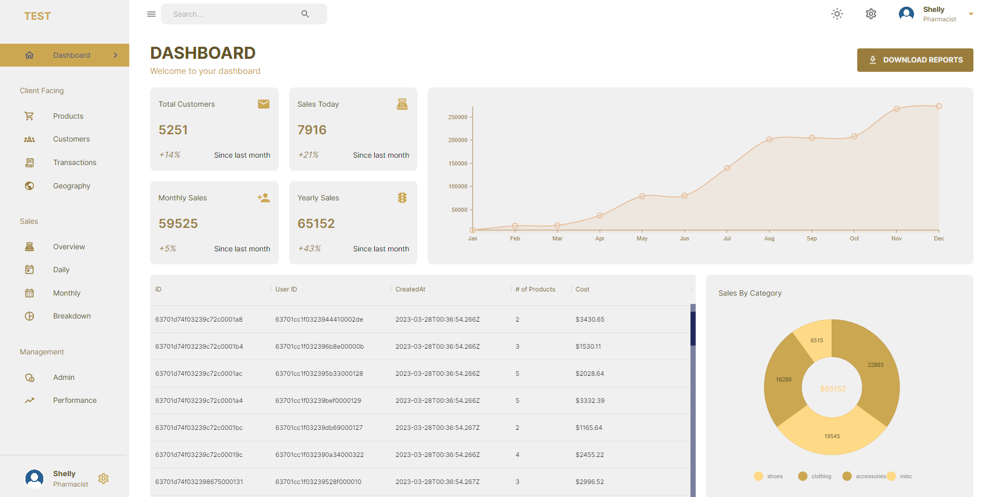

## Dashboard Project


## Overview

This application is about an admin dashboard that consists of a dashboard page of different stats, pie chart, transaction tables and a line chart. It is developed using MongoDB, Express, React and Node.js. To ensure viewing experience, this application has media queries for ample responsiveness on ALL devices.

## Getting Started

1. Clone this repository to your local machine
2. CD into cloned repository
3. Run the following command on your terminal
```
npm run dev (to run the server)
npm run start (to run react)
```
4. Sign up for a mongoDB account and create database deployment. Once finished, input your mongo URL and your port number into your env file.
5. View the application on your own local machine: http://localhost:3000/dashboard
6. Under the server file, navigate to index.js, and under "MONGOOSE SETUP", please uncomment data insert codes to populate the database once and then proceed to comment it out. Then refresh the page.
7. You're now good to go. App URL coming soon.
